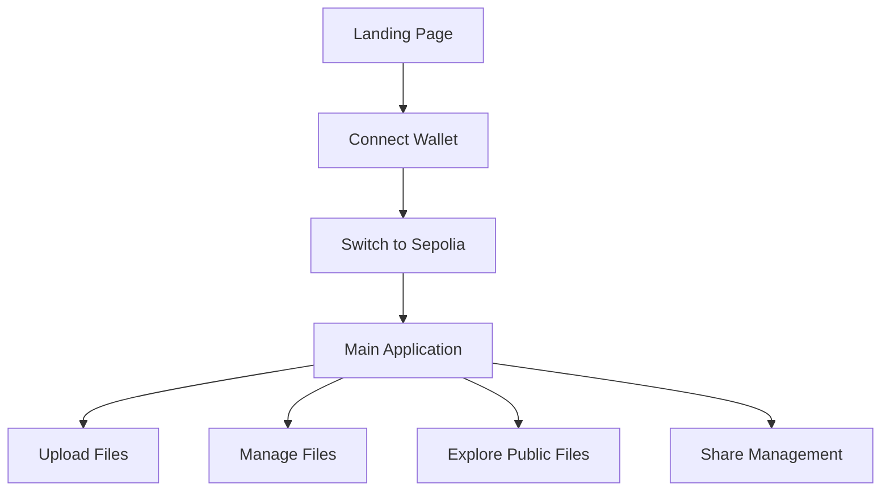

# STORIUM - Decentralized Cloud Storage Platform

A revolutionary decentralized cloud storage application built on Ethereum blockchain technology. STORIUM enables users to upload, store, and share any type of file using IPFS (InterPlanetary File System) and smart contracts with granular access control and a modern, intuitive interface.

## 🎯 Project Overview

STORIUM represents the next generation of cloud storage, combining the security of blockchain technology with the permanence of distributed storage. Unlike traditional cloud storage services, STORIUM gives users complete control over their data while ensuring permanent availability through IPFS.

### Key Value Propositions
- **True Ownership**: Files are owned by users, not platforms
- **Permanent Storage**: Files stored on IPFS cannot be deleted by third parties
- **Transparent Access Control**: All permissions managed through smart contracts
- **Censorship Resistant**: No central authority can remove or block files
- **Global Accessibility**: Access files from anywhere in the world

## 🌟 Features

- **Universal File Support:** Upload any file type - images, documents, videos, audio, and more
- **Decentralized Storage:** Files stored on IPFS for permanent, censorship-resistant storage
- **Smart Contract Access Control:** Blockchain-based permissions and ownership management
- **Modern Interface:** Sleek yellow/black themed design with glassmorphism effects
- **File Management:** Search, filter, and organize your files with ease
- **Secure Sharing:** Grant or revoke access to specific users through smart contracts
- **Real-time Updates:** Live file previews and status updates
- **Custom Cursor Effects:** Interactive mouse tracking with wave animations
- **Responsive Design:** Works seamlessly on desktop and mobile devices

## 🏗️ Architecture Overview

### Frontend Architecture
```
src/
├── components/
│   ├── LandingPage.jsx      # Entry point with branding
│   ├── ConnectWallet.jsx    # Wallet connection interface
│   ├── Header.jsx           # Navigation and user info
│   ├── FileUpload.jsx       # File upload with metadata
│   ├── FileManager.jsx      # Personal file management
│   ├── PublicExplorer.jsx   # Browse public files
│   └── ShareManager.jsx     # Access control management
├── App.jsx                  # Main application logic
└── main.jsx                 # React entry point
```

### Smart Contract Architecture
```
contracts/
└── GlobalStorage.sol        # Core storage contract
```

### Technology Stack
- **Frontend**: React 18 with Vite build system
- **Blockchain**: Ethereum (Sepolia testnet)
- **Storage**: IPFS via Pinata gateway
- **Web3**: Ethers.js v5 for blockchain interactions
- **Styling**: Custom CSS with glassmorphism design

## 🛠️ Technologies Used

- **Solidity:** Smart contract for file ownership and access control
- **React:** Modern front-end interface with hooks and components
- **IPFS:** Decentralized file storage via Pinata gateway
- **Ethereum:** Sepolia testnet for smart contract deployment
- **Ethers.js:** Web3 library for blockchain interactions
- **Vite:** Fast development build tool

## 🔧 Smart Contract Deep Dive

### Core Data Structures

#### FileInfo Struct
```solidity
struct FileInfo {
    string fileName;        // Original filename
    string fileType;        // Categorized type (image/document/video/audio/other)
    string ipfsHash;        // IPFS content identifier
    uint256 fileSize;       // File size in bytes
    uint256 uploadTime;     // Block timestamp
    address owner;          // File owner's wallet address
    bool isPublic;          // Public visibility flag
    string description;     // Optional metadata
    string[] tags;          // Searchable tags
}
```

#### Access Control Structure
```solidity
struct Access {
    address user;           // Granted user address
    bool access;            // Current access status
}
```

### Key Contract Functions

#### File Upload Logic
```solidity
function addFile(
    string memory _fileName,
    string memory _fileType,
    string memory _ipfsHash,
    uint256 _fileSize,
    bool _isPublic,
    string memory _description,
    string[] memory _tags
) external {
    // Validation
    require(bytes(_fileName).length > 0, "File name cannot be empty");
    require(bytes(_ipfsHash).length > 0, "IPFS hash cannot be empty");
    require(_fileSize > 0, "File size must be greater than 0");

    // Create file record
    FileInfo memory newFile = FileInfo({
        fileName: _fileName,
        fileType: _fileType,
        ipfsHash: _ipfsHash,
        fileSize: _fileSize,
        uploadTime: block.timestamp,
        owner: msg.sender,
        isPublic: _isPublic,
        description: _description,
        tags: _tags
    });

    // Store in global array and user mapping
    globalFiles.push(newFile);
    uint256 fileId = globalFiles.length - 1;
    userFileIds[msg.sender].push(fileId);

    emit FileUploaded(msg.sender, fileId, _fileName, _ipfsHash);
}
```

#### Access Control Logic
```solidity
function allow(address user) external {
    require(user != msg.sender, "Cannot grant access to yourself");
    require(user != address(0), "Invalid user address");

    ownership[msg.sender][user] = true;
    
    // Update or create access record
    bool userExists = false;
    for (uint256 i = 0; i < accessList[msg.sender].length; i++) {
        if (accessList[msg.sender][i].user == user) {
            accessList[msg.sender][i].access = true;
            userExists = true;
            break;
        }
    }
    
    if (!userExists) {
        accessList[msg.sender].push(Access(user, true));
    }

    emit AccessGranted(msg.sender, user);
}
```

### Smart Contract Logic

### Core Contract Structure

```solidity
// SPDX-License-Identifier: GPL-3.0
pragma solidity >=0.7.0 <0.9.0;

contract GlobalStorage {
    struct FileInfo {
        string fileName;
        string fileType;
        string ipfsHash;
        uint256 fileSize;
        uint256 uploadTime;
        address owner;
        bool isPublic;
        string description;
        string[] tags;
    }

    struct Access {
        address user; 
        bool access;
    }
    
    FileInfo[] public globalFiles;
    mapping(address => uint256[]) userFileIds;
    mapping(address => mapping(address => bool)) ownership;
    mapping(address => Access[]) accessList;

    // Events
    event FileUploaded(address indexed user, uint256 indexed fileId, string fileName, string ipfsHash);
    event AccessGranted(address indexed owner, address indexed user);
    event AccessRevoked(address indexed owner, address indexed user);
    event FileDeleted(address indexed user, uint256 indexed fileId);

    // Core Functions
    function addFile(string memory _fileName, string memory _fileType, string memory _ipfsHash, uint256 _fileSize, bool _isPublic, string memory _description, string[] memory _tags) external;
    function getMyFiles() external view returns(FileInfo[] memory);
    function getPublicFiles() external view returns(FileInfo[] memory);
    function getUserFiles(address _user) external view returns(FileInfo[] memory);
    function allow(address user) external;
    function disallow(address user) external;
    function deleteFile(uint256 _fileId) external;
    function shareAccess() external view returns(Access[] memory);
}
```

### Key Features

1. **File Storage:** Store file metadata and IPFS hashes on-chain
2. **Access Control:** Grant/revoke access to specific users
3. **Ownership Management:** Track file ownership and permissions
4. **Public/Private Files:** Toggle file visibility
5. **File Deletion:** Remove files with proper ownership checks
6. **Event Logging:** Emit events for all major actions

### Access Control Logic

```javascript
// Grant access to a user
await contract.allow(userAddress);

// Revoke access from a user  
await contract.disallow(userAddress);

// Get current access list
const accessList = await contract.shareAccess();

// Check if user has access (built into getUserFiles)
const files = await contract.getUserFiles(targetAddress);
```

### File Management Logic

```javascript
// Upload a file
await contract.addFile(
  fileName,
  fileType,
  ipfsHash,
  fileSize,
  isPublic,
  description,
  tags
);

// Get user's files
const myFiles = await contract.getMyFiles();

// Get public files
const publicFiles = await contract.getPublicFiles();

// Delete a file
await contract.deleteFile(fileId);
```

## 🔄 Application Flow

### 1. User Journey


### 2. File Upload Process
```javascript
// Frontend upload flow
const handleSubmit = async (e) => {
    e.preventDefault()
    
    // 1. Upload to IPFS via Pinata
    const formData = new FormData()
    formData.append("file", file)
    
    const resFile = await axios({
        method: "post",
        url: "https://api.pinata.cloud/pinning/pinFileToIPFS",
        data: formData,
        headers: {
            pinata_api_key: import.meta.env.VITE_PINATA_API_KEY,
            pinata_secret_api_key: import.meta.env.VITE_PINATA_SECRET_KEY,
            "Content-Type": "multipart/form-data",
        },
    })

    // 2. Get IPFS hash and file metadata
    const ipfsHash = resFile.data.IpfsHash
    const fileType = getFileType(file)
    const tagArray = tags.split(',').map(tag => tag.trim()).filter(tag => tag)
    
    // 3. Store metadata on blockchain
    await contract.addFile(
        file.name,
        fileType,
        ipfsHash,
        file.size,
        isPublic,
        description,
        tagArray
    )
}
```

### 3. File Retrieval Logic
```javascript
// Get user's files
const getFiles = async () => {
    try {
        const fileData = await contract.getMyFiles()
        const formattedFiles = fileData.map((file, index) => ({
            id: index,
            fileName: file.fileName,
            fileType: file.fileType,
            ipfsHash: file.ipfsHash,
            fileSize: parseInt(file.fileSize.toString()),
            uploadTime: new Date(parseInt(file.uploadTime.toString()) * 1000),
            isPublic: file.isPublic,
            description: file.description,
            tags: file.tags,
            url: `https://gateway.pinata.cloud/ipfs/${file.ipfsHash}`
        }))
        
        setFiles(formattedFiles)
    } catch (error) {
        console.error("Error fetching files:", error)
    }
}
```

## 🚀 Quick Start

### Prerequisites

- Node.js (v16 or higher)
- MetaMask browser extension
- Sepolia testnet ETH (get from faucet)
- Pinata account for IPFS access

### Installation

1. **Clone the repository:**
   ```bash
   git clone <repository-url>
   cd storium
   ```

2. **Install dependencies:**
   ```bash
   npm install
   ```

3. **Configure environment variables:**
   Create a `.env` file in the root directory:
   ```env
   VITE_PINATA_API_KEY=your_pinata_api_key
   VITE_PINATA_SECRET_KEY=your_pinata_secret_key
   VITE_PINATA_JWT=your_pinata_jwt_token
   ```

4. **Deploy the smart contract:**
   - Open [Remix IDE](https://remix.ethereum.org/)
   - Copy the contract code from the Deploy section in the app
   - Compile and deploy to Sepolia testnet
   - Copy the deployed contract address

5. **Start the application:**
   ```bash
   npm run dev
   ```

6. **Connect your contract:**
   - Open the application
   - Click "ENTER STORIUM"
   - Connect your MetaMask wallet
   - The app will automatically use the pre-configured contract address

## 📱 Usage

### Getting Started
1. **Enter STORIUM:** Click the main entry button on the landing page
2. **Connect Wallet:** Install MetaMask and connect your wallet to Sepolia testnet
3. **Upload Files:** Drag and drop or browse to select any file type
4. **Manage Files:** View, search, and organize your uploaded files
5. **Share Access:** Grant specific users access to your files
6. **Explore Public Files:** Browse files shared by the community

### File Management
- **Search:** Find files by name using the search bar
- **Filter:** Filter by file type (images, documents, videos, etc.)
- **Sort:** Organize by date, name, or file size
- **Preview:** View images directly in the interface
- **Download:** Download files directly from IPFS
- **Delete:** Remove files permanently (with confirmation)

### Access Control & Sharing
- **Grant Access:** Share your files with specific wallet addresses
- **Revoke Access:** Remove access permissions at any time
- **View Permissions:** See who has access to your files in the Share tab
- **Public/Private:** Toggle file visibility when uploading

### File Upload Process
1. **Select File:** Drag and drop or browse for any file type
2. **Add Metadata:** Optional description and tags for better organization
3. **Set Visibility:** Choose between public (visible to all) or private access
4. **Deploy:** Upload to IPFS and record on blockchain

## 🔐 Security Features

### Access Control Implementation
```solidity
// Permission checking for file access
function getUserFiles(address _user) external view returns (FileInfo[] memory) {
    require(_user == msg.sender || ownership[_user][msg.sender], 
            "Access denied: You don't have permission to view these files");
    // ... rest of function
}
```

### Data Validation
```solidity
// Input validation in addFile function
require(bytes(_fileName).length > 0, "File name cannot be empty");
require(bytes(_ipfsHash).length > 0, "IPFS hash cannot be empty");
require(_fileSize > 0, "File size must be greater than 0");
```

### Ownership Verification
```solidity
// Only file owner can delete
function deleteFile(uint256 _fileId) external {
    require(_fileId < globalFiles.length, "File does not exist");
    require(globalFiles[_fileId].owner == msg.sender, "Only owner can delete file");
    // ... deletion logic
}
```

- **Smart Contract Security:** Solidity-based access control
- **Decentralized Storage:** Files stored on IPFS, not centralized servers
- **Wallet Authentication:** MetaMask integration for secure user authentication
- **Immutable Records:** Blockchain ensures tamper-proof file records
- **Access Verification:** Cryptographic proof of file access rights

## 🎨 Frontend Implementation Details

### State Management
```javascript
// Main application state
const [account, setAccount] = useState("")           // Connected wallet address
const [contract, setContract] = useState(null)      // Contract instance
const [provider, setProvider] = useState(null)      // Web3 provider
const [connected, setConnected] = useState(false)   // Connection status
const [activeTab, setActiveTab] = useState("upload") // Current view
const [networkError, setNetworkError] = useState(false) // Network validation
```

### Web3 Integration
```javascript
// Contract initialization
const connectWallet = async () => {
    if (window.ethereum) {
        const provider = new ethers.providers.Web3Provider(window.ethereum)
        await provider.send("eth_requestAccounts", [])
        const signer = provider.getSigner()
        const address = await signer.getAddress()
        
        setAccount(address)
        setProvider(provider)
        setConnected(true)
        
        // Initialize contract
        const contract = new ethers.Contract(contractAddress, CONTRACT_ABI, signer)
        setContract(contract)
    }
}
```

### File Type Classification
```javascript
const getFileType = (file) => {
    const extension = file.name.split('.').pop().toLowerCase()
    const imageTypes = ['jpg', 'jpeg', 'png', 'gif', 'webp', 'svg']
    const documentTypes = ['pdf', 'doc', 'docx', 'txt', 'rtf']
    const videoTypes = ['mp4', 'avi', 'mov', 'wmv', 'flv']
    const audioTypes = ['mp3', 'wav', 'flac', 'aac']
    
    if (imageTypes.includes(extension)) return 'image'
    if (documentTypes.includes(extension)) return 'document'
    if (videoTypes.includes(extension)) return 'video'
    if (audioTypes.includes(extension)) return 'audio'
    return 'other'
}
```

## 🎨 Design Features

### Visual Design
- **Yellow/Black Theme:** Sophisticated color scheme with gold accents
- **Glassmorphism:** Semi-transparent panels with blur effects
- **Custom Cursor:** Interactive mouse tracking with wave animations
- **Smooth Animations:** Hover effects and micro-interactions
- **Responsive Layout:** Optimized for all screen sizes

### User Experience
- **Landing Page:** Elegant entry point with tagline "Secure. Simple. Shared."
- **Wallet Connection:** Clear explanation of why wallet connection is needed
- **File Previews:** Image thumbnails and file type indicators
- **Loading States:** Visual feedback during operations
- **Error Handling:** User-friendly error messages and guidance

## 🌐 Network Configuration

### Sepolia Testnet Setup
```javascript
const SEPOLIA_CHAIN_ID = '0xaa36a7'
const SEPOLIA_CONFIG = {
    chainId: SEPOLIA_CHAIN_ID,
    chainName: 'Sepolia Test Network',
    nativeCurrency: {
        name: 'SepoliaETH',
        symbol: 'ETH',
        decimals: 18,
    },
    rpcUrls: ['https://sepolia.infura.io/v3/'],
    blockExplorerUrls: ['https://sepolia.etherscan.io/'],
}
```

### Network Switching Logic
```javascript
const switchToSepolia = async () => {
    try {
        await window.ethereum.request({
            method: 'wallet_switchEthereumChain',
            params: [{ chainId: SEPOLIA_CHAIN_ID }],
        })
    } catch (switchError) {
        if (switchError.code === 4902) {
            // Network not added, add it
            await window.ethereum.request({
                method: 'wallet_addEthereumChain',
                params: [SEPOLIA_CONFIG],
            })
        }
    }
}
```

### Sepolia Testnet
- **Chain ID:** 11155111 (0xaa36a7)
- **RPC URL:** https://sepolia.infura.io/v3/
- **Block Explorer:** https://sepolia.etherscan.io/
- **Faucet:** Get test ETH from Sepolia faucets

### Environment Setup
```env
VITE_PINATA_API_KEY=your_pinata_api_key
VITE_PINATA_SECRET_KEY=your_pinata_secret_key
VITE_PINATA_JWT=your_pinata_jwt_token
```

## 📊 Data Flow Architecture

### Upload Flow
1. **File Selection**: User selects file via drag-drop or file picker
2. **Metadata Input**: User adds description, tags, and visibility settings
3. **IPFS Upload**: File uploaded to Pinata IPFS gateway
4. **Blockchain Storage**: File metadata stored in smart contract
5. **Confirmation**: Transaction confirmed and file appears in user's list

### Access Control Flow
1. **Grant Access**: Owner calls `allow(address)` function
2. **Permission Storage**: Access stored in `ownership` mapping
3. **Access List Update**: User added to owner's access list
4. **File Retrieval**: Authorized user can call `getUserFiles(owner)`

### File Retrieval Flow
1. **Permission Check**: Contract verifies user has access
2. **Metadata Retrieval**: File metadata returned from blockchain
3. **IPFS Access**: Frontend constructs IPFS gateway URLs
4. **File Display**: Files rendered with metadata and actions

## 🔄 Application Flow

1. **Landing Page:** User sees STORIUM branding and enters the app
2. **Wallet Connection:** Connect MetaMask and switch to Sepolia if needed
3. **Contract Integration:** App uses pre-configured contract address
4. **File Operations:** Upload, manage, share, and explore files
5. **Access Management:** Grant/revoke permissions through Share tab

## 🛠️ Development Setup

### Prerequisites
```bash
# Required tools
- Node.js v16+
- MetaMask browser extension
- Pinata account (for IPFS)
- Sepolia testnet ETH
```

### Environment Configuration
```env
# .env file
VITE_PINATA_API_KEY=your_pinata_api_key
VITE_PINATA_SECRET_KEY=your_pinata_secret_key
VITE_PINATA_JWT=your_pinata_jwt_token
```

### Installation Steps
```bash
# 1. Install dependencies
npm install

# 2. Start development server
npm run dev

# 3. Deploy contract to Sepolia
# Use Remix IDE with the provided contract code

# 4. Update contract address in App.jsx
const [contractAddress, setContractAddress] = useState("YOUR_DEPLOYED_CONTRACT_ADDRESS")
```

## 🔍 Code Structure Analysis

### Component Hierarchy
```
App.jsx (Root)
├── LandingPage.jsx (Entry point)
├── ConnectWallet.jsx (Wallet connection)
└── Main Application
    ├── Header.jsx (Navigation)
    ├── FileUpload.jsx (Upload interface)
    ├── FileManager.jsx (Personal files)
    ├── PublicExplorer.jsx (Community files)
    └── ShareManager.jsx (Access control)
```

### State Management Pattern
```javascript
// Centralized state in App.jsx
const [globalState, setGlobalState] = useState({
    account: "",
    contract: null,
    provider: null,
    connected: false,
    activeTab: "upload"
})

// Props drilling for component communication
<FileUpload contract={contract} account={account} provider={provider} />
<FileManager contract={contract} account={account} />
```

### Error Handling Strategy
```javascript
// Comprehensive error handling
try {
    await contract.addFile(/* parameters */)
    alert("File uploaded successfully!")
} catch (error) {
    console.error("Upload error:", error)
    if (error.code === 'CALL_EXCEPTION') {
        alert("Contract call failed. Please check network connection.")
    } else {
        alert("Failed to upload file. Please try again.")
    }
}
```

## 🎨 Design System

### Color Palette
```css
/* Primary Colors */
--primary-gold: #ffd700;
--primary-amber: #ffb300;
--primary-dark: #0a0a0a;

/* Accent Colors */
--accent-cyan: #00d4ff;
--accent-pink: #ff77c6;
--accent-green: #00ff88;

/* Semantic Colors */
--success: #00ff88;
--warning: #ffc107;
--error: #ff6b6b;
--info: #00d4ff;
```

### Animation System
```css
/* Floating animation for icons */
@keyframes float {
    0%, 100% { transform: translateY(0px); }
    50% { transform: translateY(-8px); }
}

/* Quantum spinner for loading states */
@keyframes quantumSpin {
    0% { transform: rotate(0deg); }
    100% { transform: rotate(360deg); }
}

/* Hover effects for interactive elements */
.interactive-element:hover {
    transform: translateY(-4px);
    box-shadow: 0 20px 40px rgba(255, 215, 0, 0.3);
}
```

## 🔄 Business Logic Implementation

### File Upload Business Logic
```javascript
const handleSubmit = async (e) => {
    e.preventDefault()
    
    // Validation
    if (!file) {
        alert("Please select a file first")
        return
    }

    setUploading(true)
    
    try {
        // Step 1: Upload to IPFS
        const formData = new FormData()
        formData.append("file", file)
        
        const ipfsResponse = await axios.post(
            "https://api.pinata.cloud/pinning/pinFileToIPFS",
            formData,
            { headers: { /* Pinata credentials */ } }
        )

        // Step 2: Process metadata
        const ipfsHash = ipfsResponse.data.IpfsHash
        const fileType = getFileType(file)
        const tagArray = tags.split(',').map(tag => tag.trim()).filter(tag => tag)
        
        // Step 3: Store on blockchain
        await contract.addFile(
            file.name,
            fileType,
            ipfsHash,
            file.size,
            isPublic,
            description,
            tagArray
        )
        
        // Step 4: Reset form
        resetForm()
        alert("File uploaded successfully!")
        
    } catch (error) {
        handleUploadError(error)
    } finally {
        setUploading(false)
    }
}
```

### Access Control Business Logic
```javascript
// Grant access to another user
const grantAccess = async () => {
    // Validation
    if (!newAddress.trim()) {
        alert("Please enter a valid address")
        return
    }

    if (!ethers.utils.isAddress(newAddress)) {
        alert("Please enter a valid Ethereum address")
        return
    }

    setGranting(true)
    try {
        // Call smart contract
        await contract.allow(newAddress)
        
        // Update UI
        alert("Access granted successfully!")
        setNewAddress("")
        loadAccessList()
    } catch (error) {
        console.error("Error granting access:", error)
        alert("Failed to grant access. Please try again.")
    } finally {
        setGranting(false)
    }
}
```

## 📱 User Interface Features

### Responsive Design
- **Desktop**: Full-featured interface with sidebar navigation
- **Tablet**: Adapted layout with collapsible elements
- **Mobile**: Bottom navigation with optimized touch targets

### Interactive Elements
- **Drag & Drop**: File upload with visual feedback
- **Real-time Search**: Instant filtering of file lists
- **Hover Effects**: Smooth animations and state changes
- **Loading States**: Visual feedback during blockchain operations

### Accessibility Features
- **Keyboard Navigation**: Full keyboard support
- **Screen Reader Support**: Semantic HTML structure
- **High Contrast**: Sufficient color contrast ratios
- **Focus Indicators**: Clear focus states for all interactive elements

## 🚀 Deployment Guide

### Smart Contract Deployment
1. **Open Remix IDE**: Navigate to https://remix.ethereum.org/
2. **Create Contract**: Copy `contracts/GlobalStorage.sol` content
3. **Compile**: Use Solidity compiler 0.8.x
4. **Deploy**: Connect MetaMask and deploy to Sepolia
5. **Copy Address**: Save deployed contract address

### Frontend Deployment
```bash
# Build for production
npm run build

# Deploy to hosting service
# Update contract address in App.jsx before building
```

### Environment Setup
```bash
# Required environment variables
VITE_PINATA_API_KEY=your_api_key
VITE_PINATA_SECRET_KEY=your_secret_key
VITE_PINATA_JWT=your_jwt_token
```

## 🧪 Testing Strategy

### Contract Testing
```solidity
// Test file upload
function testFileUpload() public {
    contract.addFile("test.jpg", "image", "QmHash", 1024, true, "Test file", ["test"]);
    FileInfo[] memory files = contract.getMyFiles();
    assert(files.length == 1);
}

// Test access control
function testAccessControl() public {
    contract.allow(address(0x123));
    bool hasAccess = contract.hasAccess(msg.sender, address(0x123));
    assert(hasAccess == true);
}
```

### Frontend Testing
```javascript
// Component testing with React Testing Library
import { render, screen } from '@testing-library/react'
import FileUpload from './FileUpload'

test('renders file upload component', () => {
    render(<FileUpload />)
    expect(screen.getByText('Quantum File Upload')).toBeInTheDocument()
})
```

## 📈 Performance Optimizations

### Gas Optimization
- **Batch Operations**: Group multiple operations when possible
- **Efficient Storage**: Use appropriate data types
- **Event Logging**: Use events for off-chain data indexing

### Frontend Optimization
- **Lazy Loading**: Images loaded on demand
- **Memoization**: React.memo for expensive components
- **Code Splitting**: Dynamic imports for large components

## 🔮 Future Enhancements

### Planned Features
- **File Encryption**: Client-side encryption before IPFS upload
- **Folder Organization**: Hierarchical file structure
- **File Versioning**: Track file history and changes
- **Collaborative Editing**: Real-time collaborative features
- **Mobile App**: React Native mobile application

### Scalability Improvements
- **Layer 2 Integration**: Polygon or Arbitrum for lower gas costs
- **IPFS Clustering**: Multiple IPFS providers for redundancy
- **Caching Layer**: Redis for frequently accessed metadata

## 🤝 Contributing

### Development Workflow
1. **Fork Repository**: Create your own fork
2. **Feature Branch**: Create feature-specific branches
3. **Testing**: Ensure all tests pass
4. **Documentation**: Update relevant documentation
5. **Pull Request**: Submit for review

### Code Standards
- **ESLint**: Follow established linting rules
- **Prettier**: Consistent code formatting
- **Comments**: Document complex business logic
- **Type Safety**: Use TypeScript for new features

1. Fork the repository
2. Create a feature branch
3. Make your changes
4. Test thoroughly on Sepolia testnet
5. Submit a pull request

## 📄 License

This project is licensed under the GPL-3.0 License - see the LICENSE file for details.

## 🆘 Support

If you encounter any issues:

1. **Network Issues:** Ensure you're connected to Sepolia testnet
2. **Gas Fees:** Make sure you have sufficient Sepolia ETH
3. **Contract Errors:** Verify the contract address is correct
4. **File Upload:** Check your Pinata API credentials

For additional help, please open an issue in the repository.

## 🆘 Troubleshooting

### Common Issues

#### MetaMask Connection
```javascript
// Check if MetaMask is installed
if (!window.ethereum) {
    alert("Please install MetaMask to use this application")
    return
}

// Handle account changes
window.ethereum.on('accountsChanged', (accounts) => {
    if (accounts.length === 0) {
        // User disconnected
        setConnected(false)
        setAccount("")
    } else {
        // Account changed
        window.location.reload()
    }
})
```

#### Network Issues
```javascript
// Verify correct network
const checkNetwork = async () => {
    const chainId = await window.ethereum.request({ method: 'eth_chainId' })
    if (chainId !== SEPOLIA_CHAIN_ID) {
        setNetworkError(true)
        return false
    }
    return true
}
```

#### Contract Interaction Errors
```javascript
// Handle contract call failures
try {
    await contract.addFile(/* parameters */)
} catch (error) {
    if (error.code === 'CALL_EXCEPTION') {
        alert("Contract call failed. Please check your connection and try again.")
    } else if (error.code === 'INSUFFICIENT_FUNDS') {
        alert("Insufficient ETH for gas fees. Please add more ETH to your wallet.")
    } else {
        alert(`Transaction failed: ${error.message}`)
    }
}
```

## 📊 Technical Specifications

### Performance Metrics
- **File Upload**: ~30 seconds (including IPFS and blockchain)
- **File Retrieval**: ~2 seconds (cached metadata)
- **Search Performance**: Real-time filtering up to 1000+ files
- **Gas Costs**: ~0.001-0.005 ETH per transaction

### Supported File Types
- **Images**: JPG, PNG, GIF, WebP, SVG
- **Documents**: PDF, DOC, DOCX, TXT, RTF
- **Videos**: MP4, AVI, MOV, WMV, FLV
- **Audio**: MP3, WAV, FLAC, AAC
- **Other**: Any file type supported

### Browser Compatibility
- **Chrome**: 90+
- **Firefox**: 88+
- **Safari**: 14+
- **Edge**: 90+

## 🎯 Roadmap

- [ ] Multi-chain support (Polygon, BSC)
- [ ] File encryption/decryption
- [ ] Folder organization
- [ ] File versioning
- [ ] Collaborative editing
- [ ] Mobile app development

---

**Created by Lies_Of_Code** - Revolutionizing decentralized storage with blockchain technology

*This documentation provides comprehensive insights into STORIUM's architecture, implementation, and business logic for technical interviews and code reviews.*
